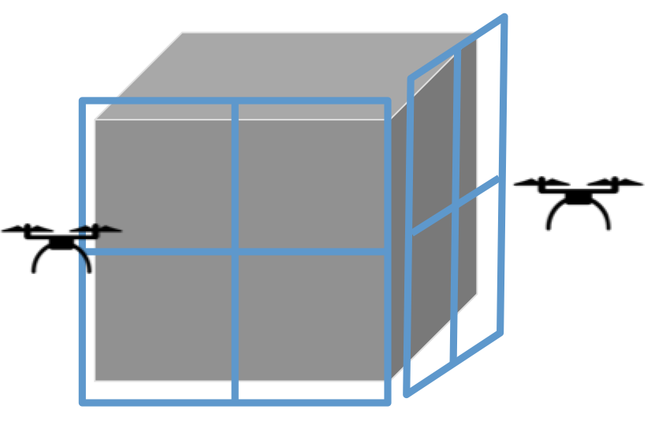
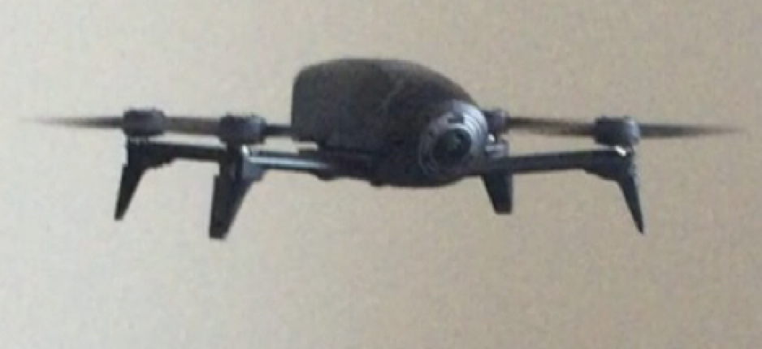
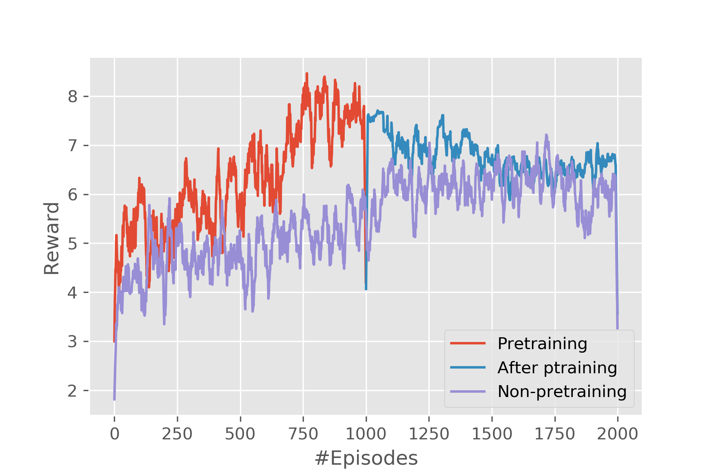
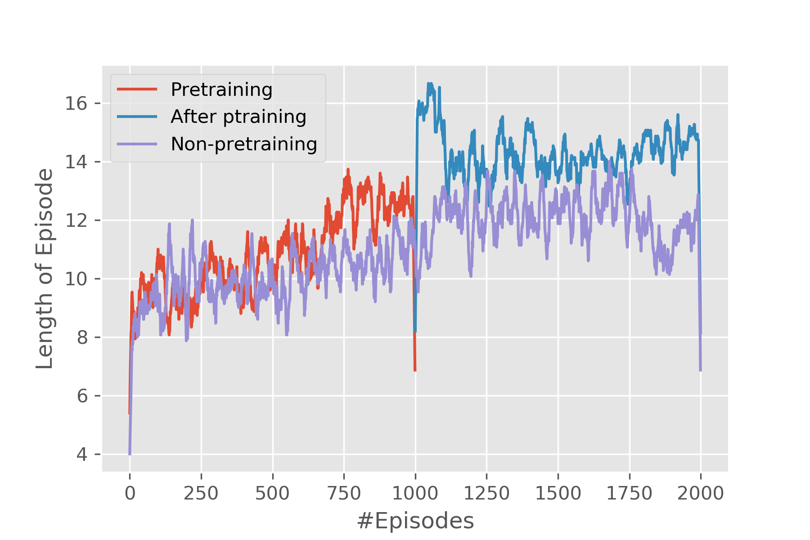
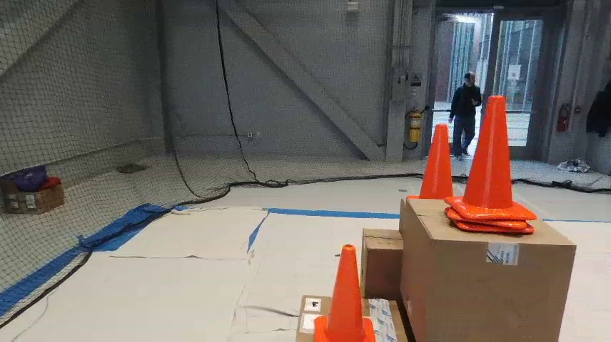
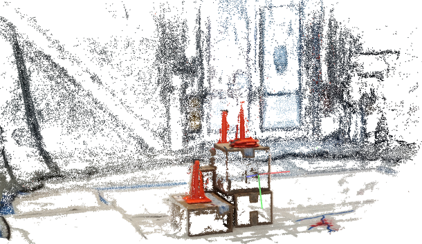
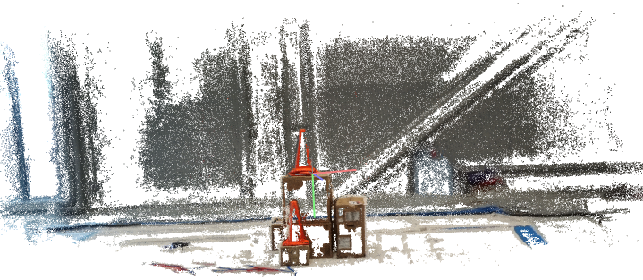

Introduction
============

Controlling drones without human intervention is a complex task because
it involves accurate real-time decision making, especially in the
multiple drones case. To coordinate the drones, we use multi-agent
reinforcement learning algorithm. Model parameters are stored on the
overall control server, and drones provide real-time information back to
the server while the server sends back the decision. Multiple agents
share the same parameters. 3d reconstruction is performed using pictures
taken by drones. In short, the project follows the pipeline below:

1.  Develop multi-agent reinforcement learning for the coordination of
    drones.

2.  Collect data and construct 3D models as the drones flying around the
    object.

**Motivation:** 3D reconstruction is getting more and more popular in
research and industrial circles as the field of computer vision and
graphics matures. To build a model of an object, sufficient amount of
pictures with overlaps are required. In its essence, a 3D model combines
information from all those images and reduces redundancy and makes it
easier for humans to process the information. This concise information
model comes in very handy when quick time-response in required (e.g.
fire rescue missions). Thus, the idea of reconstructing a 3D model using
pictures taken by drones becomes promising. Most drones accomplish their
tasks controlled by humans, which is expensive and error-prone. To
address this problem, we apply multi-agent reinforcement learning
algorithm to control multiple drones such that the drones can coordinate
with each other and scan the object automatically.

The reporting of disaster incidents usually relies on information
collection from authorities which is considered to be expensive. These
disaster situation reports often fail to provide actionable information
to incident response team ahead of time. There are very few existing
incident response frameworks that take into account of the known
valuable information. Additionally, this information can be supplemented
by drones taking pictures or videos from the disaster scene. 3D scanning
can help localize disaster situations such as fire inside building
structures and can help plan and organize search and rescue missions. In
this project, we are working towards forming a team of drones that could
form a real-time 3D map of the location so that we have actionable and
fine grained information about the area.

**About the Drone:** We are using Parrot Bebop2 drone for the purpose of
this project. It is equipped with 14 megapixel camera with fish-eye lens
for capturing images, Quad core GPU and 8 GB flash memory. It is capable
of flying, filming and taking photographs both indoors and outdoors
which will be very useful for our 3D reconstruction.Technical
specifications of the drone are mentioned in the Table. In addition to it, our drone also has the
following sensors on board:

-   Acceleration sensor

-   Gyrometer

-   Magnetometer

 
       Item                   Configuration
    Camera               14 mega-pixels with fish-eye lens
    Video                3-axis full HD 1080p
    Stabilisation        Digital stabilisation (Parrot system)
    Battery life         25 minutes flying time (with 2700 mAh battery)
    GPS                  Yes
    Processor            Dual core processor with quad-core GPU
    Wi-Fi                802.11a/b/g/n/ac
    Network              MIMO Dual band
    Wi-Fi Aerials        2.4 and 5 GHz dual dipole aerials
    Signal range         300 m
    Video resolution     1920 x 1080p (30 fps)
    Photo resolution     4096 x 3072 pixels
    Video encoding       H264
    Video stabilizer     3-axis digital system
    Internal memory      8 GB Flash

**Our Approach:** The model we are developing applies Deep Multi-Agent
Reinforcement Learning (DMARL) algorithm. There are multiple drones
controlled by one server deployed in the field doing data collection. To
collect images of an object from different views, we divide the object
into several faces and deploy one drone for each face. For each drone,
to make the problem simpler and make it easier to train the agent, we
discretize the space into 2D grids and it will be illegal for drones to
move outside of the grids. Furthermore, the distance between drones and
the object face remains unchanged which downgrades the problem into a 2D
grid problem. To reconstruct 3D maps from pictures, feature points are
needed. In this paper, we used Binary Robust Independent Elementary
Features (BRIEF) as feature detector which generates binary descriptors
of feature points in an image. To get more feature-rich images, the
agent is trained to collect images containing with more new feature
points. Policy gradient framework is adopted in our framework where a
deep neural network takes the place of policy and actions are sampled
from the output of the network. After data collection, images are fed
into COLMAP, which is a 3D reconstruction software using Structure from
Motion (SfM) and Multi-View Stereo (MVS) techniques
[@schoenberger2016sfm; @schoenberger2016mvs].

**Paper outline:** In Section 2, we give a brief explanation of deep
reinforcement learning and 3D reconstruction techniques. In Section 3,
we talk about the related research done in this area. In section 4, we
present the architecture and the system design including the MARL
frameworks. In Section 5, we study our framework by varying the design
parameters and also evaluate its performance in simulator and also in
real life setting. Finally, we conclude the paper by mentioning our
possible future directions in Section 6.

Background
==========

Humans usually tend to perceive lot of information about any
three-dimensional structure by just moving around it. As mentioned
earlier, using human agents is very slow and burdensome to personnel who
might be better served elsewhere, whereas drones are readily accessible
and non-intrusive if used with caution.

Deep Reinforcement Learning
---------------------------

A typical characteristic of Reinforcement Learning is the interaction
with the environment. An RL agent learns to behave according to the
reward feedback given by the environment after taking an action.
However, to train an agent in the real settings is expensive and
dangerous. Deep learning has had a significant impact on many areas in
machine learning improving the state of the art in tasks such as object
detection, speech recognition, and language translation. Recently, deep
learning has been combined with reinforcement-learning to solve
problems. Most prominent is the recent use of a deep Q-network(DQN) in
Q-learning. Implementing deep learning architecture such as deep neural
networks with reinforcement learning creates a powerful model that is
capable to scale to previously unsolvable problems. DRL has many
applications in various domains such as healthcare, robotics, smart
grids and finance.

3D Reconstruction
-----------------

Much has been accomplished in the area of 3D reconstruction. We intend
to address the speed of collection of image data for 3D reconstruction
and the intensity of the 3D model. One of the relevant techniques used
to reconstruct an object from the 2D images is Structure from Motion
(SfM). While mostly used in geosciences as a method of bringing down the
costs of topographic surveying, SfM provides a necessary tool set to
recreate a scene or object from a collection of images [@book].
Structure from Motion can produce point cloud based 3D models similar to
that of a LiDAR. This technique could be used for creating a high
resolution digital surface or elevation models. SfM is based on the same
principles as stereoscopic photogrammetry. In stereo phogrammetry,
triangulation is used to calculate the relative 3-D positions (x,y,z,)
of objects from stereo pairs as shown in
figure. Traditionally
these techniques require expensive specialized equipment and software.

Common points are identified in each image. A line of sight or ray can
be constructed from the camera location to the point on the object. The
intersection of these rays (triangulation) determines the
three-dimensional location of the point.

To find feature points between the images, corner points such as the
edges with gradients in multiple directions are tracked from one image
to the next. One of the most widely used feature detection methods is
the scale-invariant feature transform (SIFT). SIFT algorithm in computer
vision detects and describes local features in images. It uses the
maxima from a difference-of-Gaussians (DOG) pyramid as features
[@lowe2004distinctive]. A dense point cloud of the area is then
determined using the known camera parameters and the feature points from
different angled images.

Related Work
============

The area of building a 3D map using reinforcement learning has not been
fully explored but there are still some excellent work. In
[@sadhu2016argus], they tried to build a framework to collect real-time
data of the disaster scene from drones and mobile phones by using deep
reinforcement learning algorithm as the coordinator. However, the reward
function is defined based on the ratio of fire in the captured image,
which is limited because a model that can recognize fire must be trained
first and the error of this fire recognizer propagates to the
reinforcement learning framework. Also, they never deployed it on actual
drone surveying the site and collecting data. In our work, we define the
reward as the new feature points in the incoming image which helps to
improve the 3D reconstruction of an environment and also deploy the
drone onsite.

In [@han2019deep], the authors present a deep reinforcement learning
method of progressive view for 3D point scene completion under volume
guidance and achieved high-quality scene reconstruction from only a
single depth image with severe occlusion. In [@li2015recurrent] authors
have proposed a hybrid models that combines both supervised learning
(SL) and reinforcement learning (RL), trained in a joint fashion: The SL
component is a recurrent neural networks (RNN) or its long short-term
memory (LSTM) version, thus providing an effective way of learning the
representation of hidden states.

There has been a comprehensive study on MARL framework done in
[@bu2008comprehensive]. The paper provides a detailed discussion of MARL
techniques, cooperative and competitive, for autonomous multiple agents
learning how to solve dynamic tasks using learning techniques. In
cooperative framework, the agents try to work towards a common goal with
same rewards; while in the competitive framework the agents compete
against each other with opposite rewards. In [@wharton2009simulation],
the applicability of MARL is studied especially in the case of building
evacuation in case of non-stationary fire. Similarly, [@schonauer20133d]
focuses on the design and development of a mobile system that can 3D
reconstruct building's interior and fuse it with thermal camera image as
well. [@ramchurn2016human] leverages an MDP (Markov Decision Process)
architecture to coordinate a response team in after an incident. In
[@sadhu2016argus], authors describe a model for real-time incident
response data collection to build a 3D mapping of the disaster scene
with the help of agents present around the incident zone to facilitate
the rescue operations. Although they described the model for real-time
data collection, they never deployed it on actual drone surveying the
site and collecting data. We aim to achieve this functionality in our
project.

Problem Solution
================

Initialize policy parameters   
***for*** t = 1 to num\_episodes ***do***  
&nbsp;&nbsp;&nbsp;&nbsp;***while*** True ***do***  
&nbsp;&nbsp;&nbsp;&nbsp;&nbsp;&nbsp;&nbsp;&nbsp;Get the state from the environment  
&nbsp;&nbsp;&nbsp;&nbsp;&nbsp;&nbsp;&nbsp;&nbsp;Feed the state to the policy network to get a distribution over the action space  
&nbsp;&nbsp;&nbsp;&nbsp;&nbsp;&nbsp;&nbsp;&nbsp;Sample from the distribution and perform the action, take an image and extract feature points  
&nbsp;&nbsp;&nbsp;&nbsp;&nbsp;&nbsp;&nbsp;&nbsp;Perform an exhaustive match between the existing feature points and the new ones  
&nbsp;&nbsp;&nbsp;&nbsp;&nbsp;&nbsp;&nbsp;&nbsp;Calculate reward according to the matches  
&nbsp;&nbsp;&nbsp;&nbsp;&nbsp;&nbsp;&nbsp;&nbsp;Record (State, Reward, Action, Next\_state) tuple  
&nbsp;&nbsp;&nbsp;&nbsp;&nbsp;&nbsp;&nbsp;&nbsp;***if*** is\_done ***do***  
&nbsp;&nbsp;&nbsp;&nbsp;&nbsp;&nbsp;&nbsp;&nbsp;&nbsp;&nbsp;&nbsp;&nbsp;***break***  
&nbsp;&nbsp;&nbsp;&nbsp;***if*** \#episodes == batch\_size ***do***  
&nbsp;&nbsp;&nbsp;&nbsp;&nbsp;&nbsp;&nbsp;&nbsp;Update the policy network's parameters

The problem is formulated into a RL problem and is solved using policy
gradient framework. To accelerate the training, we pretrain the agent to
only learn the rules first and deploy it in the simulator with the prior
knowledge.

System Design
-------------

The 3D space is continuous and if deploying the agents into the this
continuous space without any constraints, it will take a long time for
it to converge to a good performance. To ease this problem, we simplify
the problem by adding several constraints. We divide the object into
many faces and each drone is only responsible for collecting images of
one of the faces. The distance between the drone and the object is also
fixed. By this constraint, the drone's actions' degree of freedom is
reduced from 3 to 2. Furthermore, each face is divided into grids and
the drone's movements are only legal in these grids. After the
simplification, the problem is much more solvable, and the subsequent
sections will introduce the framework of the system to deal with this
simplified problem.

Problem Formulation
-------------------

Reinforcement learning is essentially an algorithm framework to solve
Markov Decision Process (MDP). If a problem is properly formulated into
a MDP, RL algorithms can be applicable. A MDP is a 4-tuple
 which has four components: state space , action
Space , policy  and reward 

-   State space : The state is defined as the current position of the
    drone and a vector which records the number of visited times of each
    grid. The state, which is essentially a feature vector, will be fed
    into the policy network to generate actions.

-   Action space : Action space are defined in a simple way. To
    simplify the complexity of the problem, we discretize the continuous
    2D space into grids. There are four actions regarding the girds:
    Left, Right, Up, Down. These 4 actions are the positive and negative
    orientations on three axes y and z and x is fixed. For one
    action, the drone only move a small predefined distance which is
    equal to the length of a grid.

-   policy : The policy is a fully-connected neural network with a
    Softmax layer as the output mapping state vector to probabilities of
    actions. It is not necessary to always choose the action with
    highest probability which is also known as greedy action selection
    because we want some randomness to exist in the agent to ensure the
    exploration. To generate next action from the policy, we only need
    to sample from the distribution provided by the policy network.

-   Reward : The agent is supposed to learn to move to those grids
    where the images contain more new features. The reward function will
    be more detailedly illustrated in the subsequent sections.

Design of Reward Function
-------------------------

The reward function is crucial to a reinforcement learning framework
because the agent is trying to maximize the cumulated reward. Thus, a
good definition of reward function will greatly benefit the learning
process. As mentioned before, the reward considers new feature points in
the incoming image. In order to determine if the feature point is
\"new\", an image descriptor database is established to store all the
unique descriptors. Once a new image is captured, run BRIEF algorithm
over it first to get a set of descriptors, which are actually binary
vectors. Then, compare each of the vector with the existing vectors in
the database by using Hamming distance. If one descriptor is far away
from every existing points, it will be inserted into the database as the
new point.

Furthermore, the drone is supposed to explore more grids instead of
sticking at only some of the grids. Thus, the reward should also assign
high rewards to those exploration actions. Suppose the existing feature
descriptors and incoming new ones are denoted as  and ,
respectively and a matrix  where  is the visited times of
the grid at th row and th column. The reward is defined as the
following:

where max\_visit is a predefined parameter and if a grid is visited more
than max\_visit times, assign a negative reward. As it can be seen from
the reward function, the reward is clipped so that it remains in the
range between -1 and +1.

Policy Gradient Agent
---------------------

To solve this problem, we have considered many reinforcement learning
models. Value-based models aims at maximizing the value function so that
the agent can find an optimal path through all the states and get the
maximum reward. However, value-based model need more a neural network to
represent the value function and a policy, which could be a neural
network as well. These methods have a great amount of parameters which
will take a tremendous number of episodes to train. Instead, policy
networks have less parameters and can map the state directly to actions.
Thus, policy neural networks is applied in our framework. The input of
the policy network is a vector of state and the output should be a
probability distribution of actions. Let  and  denote the
state and action in time step . The objective that the agent is
trying to maximize can be expressed as:

where  is the parameters of the policy neural network. Because
that the action value function is the expectation of the return, it can
be concluded that:

By combining Eq. 2 and Eq. 3, the objective becomes:

The overall objective of the reinforcement learning model is described
as Eq. 4, which basically says that the objective is the log probability
of the return, in which the policy is the neural network.

Furthermore, the performance of the reinforcement learning agent varies
from different training strategies. In our framework, a modified Monte
Carlo (MC) methods is applied. According to MC, parameters of the policy
network are updated after sampling a complete episode. However, if some
episodes are too short, it will helpless for updating the policy
network. Thus, a modified MC method is applied, in which we specify a
batch size, and only update the network when the size of the batch is
fulfilled.

Pretraining
-----------

Pretraining is a technique that has been commonly used in computer
vision, natural language processing and many other machine learning
areas. It is a term used in transfer learning, in which the model is
trained on the source distribution while it is tested in a different
distribution and the process to train the model on source distribution
is called pretraining. This area has been well-explored, and yet there
are not so much applications of these kind of techniques in
reinforcement learning settings. In [@yosinski2014transferable], it has
been pointed out that deep neural networks can learn feature extraction
ability well. The authors of [@anderson2015faster] applied pretraining
to their Q networks to learn the state-action dynamics. Before deploying
the agent to the real task, they use the current state and the current
action as input and next state and the Q value of the current state
action pair as the output. The data comes from samples of (State,
Action, Reward, Next state) pairs and it is assumed that if the agent
knows the environment dynamics, it will do well in serving as policy. In
[@abtahi2011deep], a Deep Belief Network (DBN) is used as the function
approximator. The pretraining is performed in a layer-wise manner and
the output from the last layer is regarded as the input of the next
layer.

In our system, pretraining plays a different role from the
aforementioned works. It no longer tries to learn extract features from
data, instead it learns the rules of the environment. To illustrate, the
agent is supposed to learn the following things:

-   Do not go out of the grids.

-   Do not stuck in some of the grids.

-   Visit each grid at least once.

-   Pay more visit to those feature-rich regions.

The first three can be regarded as rules, which are not related to the
images. Thus, to reduce the time for training the agent, we divide the
training phase into two steps. First, train the agent on a grid world
environment. This grid environment is very simple, the reward function
is defined as:

  
where  is the times that grid (i, j) has
been visited and max\_visit is the max of the visit times. The training
on this simplified environment is very fast and it takes only seconds to
train 10,000 episodes. The agent the first three rules during the
training on the simplified environment and it will perform well if it is
deployed on a real environment or in the real settings, which means the
process guarantees a baseline of the performance of the agent. The
second step is to deploy this pretrained agent in the simulator to
generate results.

Training in this way is much faster than directly training the agent
with zero prior knowledge of the environment in the simulator.

Performance Evaluation
======================

We are evaluating our performance on two fronts. For one, we run the
model in the simulator to test the overall performance of the framework.
Then we deploy it on real drones to run in real world.

Evaluation in Simulator
-----------------------

The simulation is run on Airsim [@airsim2017fsr], a simulator for drones
and cars built on Unreal Engine developed by Microsoft. A house is put
into the simulator and drones are put around the house in the beginning.
In the simulator, the camera of the drone is facing upfront horizontally
and high-resolution images can be directly obtained through interacting
with the simulator using program.

The metrics that will be used to evaluate the model is the total reward
of an episode and the length of the episode. Total reward of an episode
is how well an agent can perform during a single episode and the more it
gets, the better the performance is. As for length of episodes,
generally speaking, the longer it is, the more reward the agent will
get, however, in our problem it is quite so because visiting a grid too
many times will induce a negative reward. Furthermore, to test if
pretraining does any good to the process, we compared pretrained model
and non-pretrained one.

Evaluation in Real Settings
---------------------------

To see if the framework really works, we deploy it in the real world.
Two drones are used to collect pictures of a pile of boxes using
pyparrot [@pyparrot]. The configuration of drones we used is displayed
in Table.

We conducted the experiments in the Drone Lab in Richard Weeks Hall of
Engineering in Rutgers University-New Brunswick. Due to the limitation
of the number of drones we possess, only two are used. The boxes are
simplified to four faces and the drones are deployed at two adjacent
faces. Because the drone's camera is facing down by 45 degrees, thus,
before starting running the RL algorithm, the drone has to be elevated
by a small distance so that it gets some view of the object at the
starting point. Furthermore, the size of the grid and the length of one
gird also need to be determined. Here in our settings, we define a 3 by
3 grid world with 0.5 meters as the length of each grid.

There are 20 images in total that are collected by the drone. The
environment is shown in Figure and the generated 3D map is shown in Figure.
It can be seen from the 3D map that the 3D reconstruction is good, which
means both data collection part and 3D reconstruction part works well.
Though there are a lot of blanks in the 3D map, the texture and color
can tell that this is a 3D model of the experiment environment. Digging
deeper into the blank space in the 3D map, the 3D reconstruction
algorithm first extracts feature points from the pictures and areas of
walls and floors are regarded as featureless and this is the reason
there are so many blanks.
